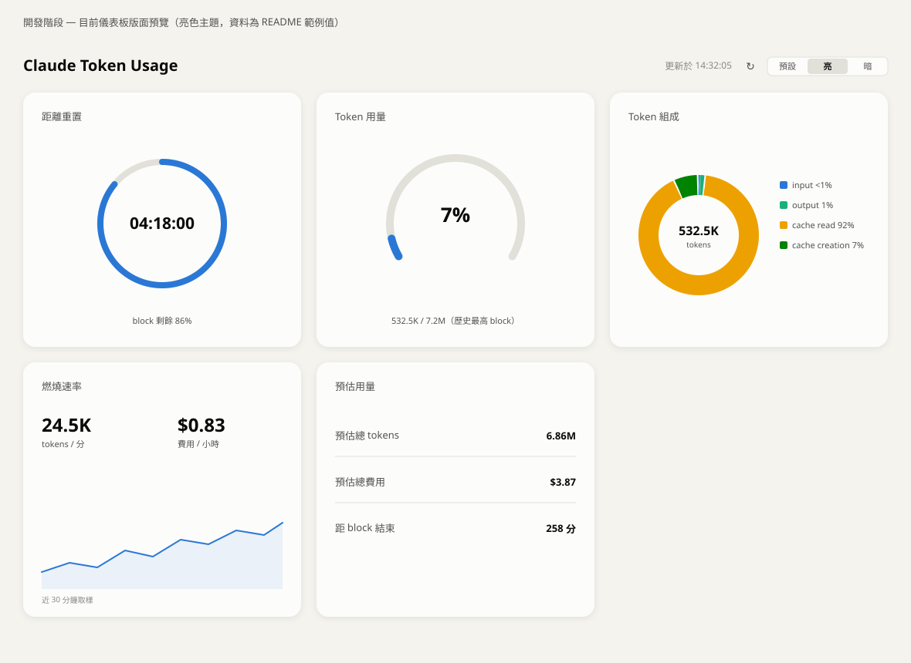
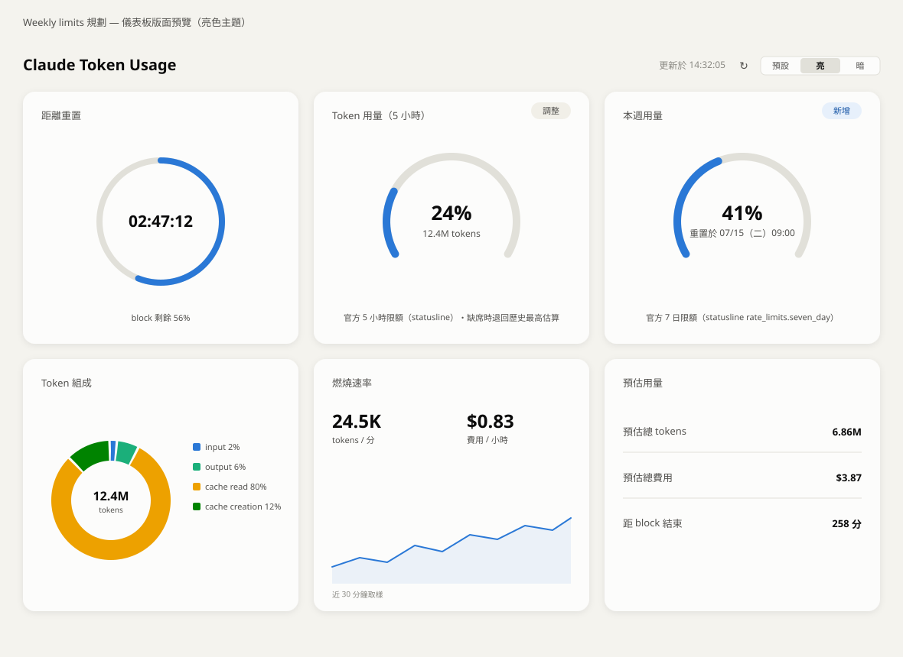

# vue-ccusage-web


Claude Code Token 用量顯示面板 — 本地執行的 Vue 應用程式，
透過 `npx ccusage blocks --json` 讀取目前 5 小時 block 的以儀表板呈現使用狀況

## 開發方式聲明

本專案為 AI 輔助開發(vibecoding)實驗：主要程式碼由 Claude Code
(Anthropic Claude Fable 5)產生，由 [@sweetmochi](https://github.com/sweetmochi)
全程監督與參與——包含需求定義、技術選型決策、逐階段程式碼審閱、
手動修改與重構，以及每階段的實際執行驗證。

分工方式：

- **架構規劃與 UI 設計方向**：人類決策，AI 提案
- **程式碼撰寫**：AI 產生初版，人類逐階段審閱並直接修改(進度見下方「開發階段」checklist)
- **型別註解與文件**：人類與 AI 共同維護
- **驗證**：每階段完成皆以 `npm run build` 型別檢查與實際執行確認

Git 記錄中由 AI 參與的 commit 皆帶有 `Co-Authored-By: Claude` 署名，
可與人類手動修改的 commit 區分。

## 功能規劃

- **剩餘時間圓環**：目前 block 距離重置 `endTime` 的倒數，daisyUI `radial-progress`
- **Token 用量儀表**：`totalTokens` 與自訂 / 歷史上限 (`--token-limit max`) 的比例，vue-echarts gauge
- **燃燒速率 (Burn Rate)**：`tokensPerMinute`、`costPerHour` 即時數值 + 迷你趨勢線
- **預估用量 (Projection)**：block 結束時的預估 token 總量與費用
- **Token 組成分布**：input / output / cache read / cache creation 圓餅圖
- **自動輪詢**：每 30 秒重新取得資料，倒數歸零時立即更新，另有手動重新整理鈕
- **主題切換**：跟隨系統 / 亮 / 暗三態，選擇記錄於 localStorage，圖表配色同步切換

## 技術架構

| 層       | 技術                                  | 說明                                                            |
| -------- | ------------------------------------- | --------------------------------------------------------------- |
| 前端框架 | Vue 3 (`<script setup>` + TypeScript) | SPA，單頁儀表板                                                 |
| 建置工具 | Vite                                  | dev server 同時擔任本地 API                                     |
| 樣式     | Tailwind CSS 4 + daisyUI 5            | stat / progress / radial-progress 元件                          |
| 圖表     | vue-echarts (ECharts)                 | gauge、pie、sparkline                                           |
| 資料來源 | `npx ccusage blocks --json`           | 由 Vite middleware 在 Node 端執行(全部 blocks，供估算 fallback) |
| 官方限額 | Claude Code statusline `rate_limits`  | `scripts/statusline.mjs` dump 至 `~/.claude/rate_limits.json`   |

### 資料流

```
ccusage CLI(讀取 ~/.claude/projects/ 的 JSONL)
        │  execFile(Node 端)
        ▼
Vite dev server middleware   GET /api/blocks
        │  fetch(每 30 秒輪詢)
        ▼
Vue composable useCcusage()
        │  reactive state
        ▼
儀表板元件(圓環 / 儀表 / 統計卡 / 圓餅圖)
```

> 瀏覽器無法直接執行 CLI，因此由 Vite 插件在 dev server 內註冊
> `/api/blocks` endpoint，於 Node 端執行 `ccusage` 並回傳 JSON。
> 本專案定位為「本地開發工具」，以 `npm run dev` 啟動即可使用。

官方 `rate_limits`（Weekly 卡牌與 5 小時卡牌官方百分比）另走一條資料流：

```
Claude Code statusline(每次狀態列更新觸發)
        │  scripts/statusline.mjs(dump 後串接原 statusline 指令，顯示不變)
        ▼
~/.claude/rate_limits.json
        │  讀檔 + 檔案 mtime(判斷資料新鮮度)
        ▼
Vite dev server middleware   GET /api/limits
        │  fetch(每 30 秒輪詢)
        ▼
Vue composable useRateLimits()
        │  reactive state(fiveHour / sevenDay / isStale)
        ▼
5 小時卡牌(官方百分比優先) / Weekly 卡牌
```

> statusline 與儀表板是兩個獨立行程，以 dump 檔為交換介質：
> Claude Code 未執行時面板讀舊檔並以 mtime 標示過期，
> 官方資料為空值或過期時 5 小時卡牌退回歷史最高估算。

## 專案結構(規劃)

```
vue-ccusage-web/
├── vite.config.ts            # Vite 設定 + /api/blocks、/api/limits middleware 插件
├── index.html
├── scripts/
│   ├── statusline.mjs        # statusline 包裝腳本(dump rate_limits 後串接原指令)
│   └── dev-with-claude.mjs   # dev server + 另開 Claude 視窗觸發 statusline
├── src/
│   ├── main.ts
│   ├── App.vue               # 版面配置(grid 儀表板)、卡牌資料來源切換
│   ├── style.css             # Tailwind / daisyUI 進入點
│   ├── types/
│   │   ├── ccusage.ts        # blocks JSON 的 TypeScript 型別
│   │   ├── statusline.ts     # statusline rate_limits 與 /api/limits 型別
│   │   ├── components.ts     # 元件 props 型別
│   │   └── theme.ts          # 主題型別
│   ├── lib/
│   │   ├── echarts.ts        # ECharts 按需註冊
│   │   ├── theme.ts          # 圖表配色(明/暗，經 CVD 驗證)與主題選項
│   │   └── format.ts         # 數字 / 時間格式化
│   ├── composables/
│   │   ├── useCcusage.ts     # 輪詢 /api/blocks、衍生值計算
│   │   ├── useRateLimits.ts  # 輪詢 /api/limits、官方限額衍生值與過期判斷
│   │   ├── useBurnRateHistory.ts # burnRate 取樣累積(趨勢線)
│   │   └── useTheme.ts       # 三態主題(跟隨系統/亮/暗)單一真相來源
│   └── components/
│       ├── TimeRemaining.vue # 剩餘時間圓環
│       ├── TokenGauge.vue    # token 用量儀表(換算 / 直接百分比雙模式)
│       ├── BurnRate.vue      # 燃燒速率統計卡
│       ├── Projection.vue    # 預估用量統計卡
│       └── TokenBreakdown.vue# token 組成圓餅圖
└── README.md
```

## ccusage 回傳資料(重點欄位)

```jsonc
{
  "blocks": [
    {
      "isActive": true,
      "startTime": "2026-07-06T14:00:00.000Z",
      "endTime": "2026-07-06T19:00:00.000Z", // block 重置時間
      "totalTokens": 532518,
      "costUSD": 0.3,
      "tokenCounts": {
        "inputTokens": 28,
        "outputTokens": 6372,
        "cacheReadInputTokens": 491495,
        "cacheCreationInputTokens": 34623,
      },
      "burnRate": { "tokensPerMinute": 24522, "costPerHour": 0.83 },
      "projection": { "remainingMinutes": 258, "totalTokens": 6859329, "totalCost": 3.87 },
      "models": ["claude-sonnet-5"],
    },
  ],
}
```

> 注意：ccusage 是由本機記錄推算，**沒有官方「剩餘額度」數字**；
> 官方百分比由 statusline `rate_limits` 資料流補足（見上方資料流）

> 估算 fallback 的百分比上限採 `--token-limit max` (歷史最高 block)

## 使用方式

```bash
npm install
npm run dev              # 啟動面板(含本地 API)
npm run dev:with-claude  # 啟動面板 + 另開 Claude Code 視窗觸發 statusline 更新
```

> `dev:with-claude` 會以最低成本組合（haiku + `MAX_THINKING_TOKENS=0` + 一則 "Say ok"）
> 另開互動 session；視窗保持開啟期間官方 `rate_limits` 持續更新（僅支援 Windows）

> 已知限制：`/api/blocks` 與 `/api/limits` 只存在於 dev server，
> `npm run preview` 或靜態部署無法取得資料。

### 啟用官方 rate_limits（Weekly 卡牌與 5 小時官方百分比）

1. 於 `~/.claude/settings.json` 將 statusline 指令指向本專案的包裝腳本（路徑改為你的專案位置）：

   ```json
   "statusLine": {
     "type": "command",
     "command": "node \"<專案絕對路徑>/scripts/statusline.mjs\""
   }
   ```

2. 原本使用的 statusline 指令改填在 `scripts/statusline.mjs` 開頭的 `INNER_COMMAND`
   （預設為 `npx -y ccstatusline@latest`），dump 完成後會原樣串接執行，顯示內容不變
3. 開新的 Claude Code session 後，statusline 每次更新都會把官方 `rate_limits`
   寫入 `~/.claude/rate_limits.json`，面板即自動採用官方百分比

> `rate_limits` 僅 Pro / Max 訂閱者可用；未完成設定或欄位為空值時，
> Weekly 卡牌顯示無資料提示，5 小時卡牌退回歷史最高估算

## 初始開發階段

- [x] 專案大綱(README / package.json)
- [x] Vite + Vue + Tailwind/daisyUI 腳手架
- [x] ccusage API middleware
- [x] useCcusage composable 與型別定義
- [x] 儀表板元件
- [x] 主題與細節調整

版面預覽：



## 第一期開發：Weekly limits 卡牌規劃與 5 小時卡牌上限來源調整

新增 Weekly 卡牌，導入 Claude Code statusline JSON 的官方 `rate_limits` 資料，
並讓 5 小時卡牌的用量百分比改採官方數據（取代歷史最高估算）

> `rate_limits` 僅 Pro / Max 訂閱者可用，含 `five_hour` / `seven_day` 兩視窗，
> 各提供 `used_percentage`（0–100）與 `resets_at`（Unix epoch 秒），以上欄位有可能為空

版面預覽：



### 階段一：建立資料來源（兩張卡共用）

- [x] statusline dump script（`scripts/statusline.mjs`）：讓 node stdin JSON 抽出 `rate_limits` 建立檔案 `~/.claude/rate_limits.json`，串接原 statusline 指令（於 `~/.claude/settings.json` 註冊）
- [x] Vite middleware 新增 `GET /api/limits`：讀 dump 檔回傳 JSON 附檔案 mtime；檔案不存在時回傳空狀態而非 500
- [x] 型別定義 `src/types/statusline.ts`：`RateLimitWindow { used_percentage, resets_at }`，`five_hour` / `seven_day` 可能回傳空值
- [x] `useRateLimits` composable：每 30 秒輪詢，衍生各視窗百分比、重置倒數、資料過期判斷（mtime 逾時則顯示「Claude Code 未在執行」）

### 階段二：建立 Weekly 卡牌

- [x] TokenGauge 參數化：新增 `title`、`limitLabel` props 與「直接傳百分比」模式（`percent`，`null` 表示無資料顯示「—」），預設值維持現行為，註腳改為可覆寫的 slot
- [x] App.vue 新增 Weekly 卡牌：`seven_day.used_percentage` 儀表版 + `resets_at` 重置時間（`formatResetAt`）；無資料時顯示 statusline 設定提示；資料過期時標示「Claude Code 未在執行」；不依賴 active block

### 階段三：修改 5 小時上限改用官方回傳數據

- [x] 儀表百分比改用 `five_hour.used_percentage`，ccusage 的 `totalTokens` 降為註腳補充資訊
- [x] fallback：官方資料為空值或過期時退回「totalTokens / 歷史最高」估算，註腳標明目前資料來源
- [x] `tokenLimit` 僅保留作 fallback 分母，註腳文案以「官方 5 小時限額」/「歷史最高 block 估算」區分資料來源

### 階段四：撰寫文件與驗證

- [x] README 資料流圖補上 statusline → dump 檔 → `/api/limits` 路徑與設定步驟（另更新技術架構表、專案結構、ccusage 註記）
- [x] `npm run build` 型別檢查；手動驗證三情境：無 dump 檔（首次）、資料齊全、mtime 過期（Claude Code 未執行）
